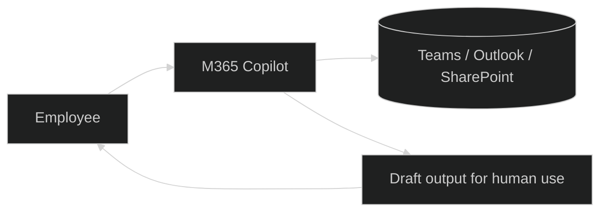

# Pattern 0 - M365 Copilot baseline (Acme)

## Use Case Guidance

Use this pattern when users need AI help directly inside Microsoft 365 with minimal build effort.

Good fit:
- Summarize meetings, chats, and documents.
- Draft emails, status updates, and first-pass content.
- Find information already available in M365 context.

Not a fit:
- Custom tool orchestration across multiple enterprise systems.
- Autonomous writes or high-risk business actions.
- Deep model customization or complex runtime control.

## Business Classification

| Dimension | Classification |
|---|---|
| Business class | Individual and team productivity |
| Typical outcomes | Time saved, faster communication, better knowledge access |
| Owner | End users with tenant admin governance |
| Change model | Fast adoption, low engineering dependency |
| Control model | Microsoft-managed experience and controls |

## Data Classification

| Data class | Pattern guidance |
|---|---|
| Internal | Default fit; use existing M365 permissions and security trimming |
| Confidential | Allowed when content stays inside approved M365 boundary |
| Restricted | Allowed only with explicit governance controls and no autonomous high-risk actions |
| Public | Fully supported |

## Mermaid Diagram

