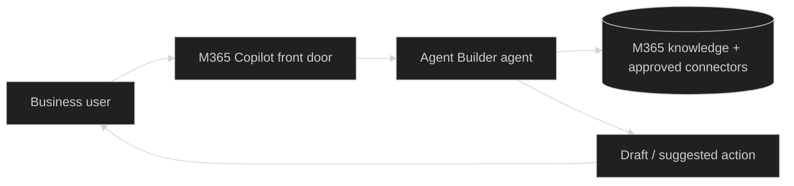

# Pattern 1 - Agent Builder in M365 Copilot (Acme)

## Use Case Guidance

Use this pattern for lightweight business-owned assistants created quickly with limited tooling complexity.

Good fit:
- Team knowledge assistants with curated instructions.
- Repetitive drafting tasks where users still approve outcomes.
- Rapid experiments where speed-to-value is critical.

Not a fit:
- Multi-system transactional orchestration.
- Scenarios requiring advanced model controls, custom runtime, or deep observability.
- Fully autonomous operations.

## Business Classification

| Dimension | Classification |
|---|---|
| Business class | Team-level augmentation |
| Typical outcomes | Faster execution of repeat knowledge tasks |
| Owner | Business analyst / power user with central guardrails |
| Change model | Iterative low-code configuration |
| Control model | Managed Copilot experience with constrained tool options |

## Data Classification

| Data class | Pattern guidance |
|---|---|
| Internal | Primary data class for this pattern |
| Confidential | Supported with role-based access and policy checks |
| Restricted | Use with caution; require explicit approval flow for any sensitive action |
| Public | Fully supported |

## Mermaid Diagram

