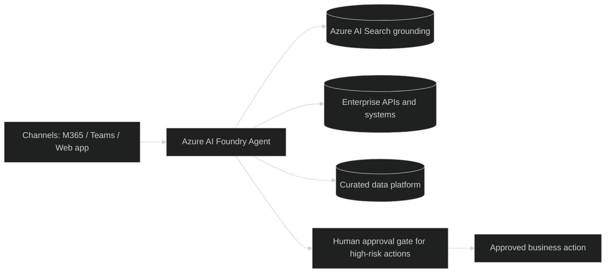

# Pattern 2 - Azure AI Foundry engineered agent (Acme)

## Use Case Guidance

Use this pattern for enterprise-grade AI solutions that need pro-code engineering control.

Good fit:
- Deep integration across multiple enterprise systems and APIs.
- Advanced grounding, evaluation, observability, and release governance.
- High-risk or high-throughput workloads requiring strict control.

Not a fit:
- Simple departmental assistants that can be delivered in managed/low-code patterns.
- Use cases with no clear owner for engineering operations.

## Business Classification

| Dimension | Classification |
|---|---|
| Business class | Strategic, enterprise, mission-critical |
| Typical outcomes | Differentiated capability, controlled scale, governed automation |
| Owner | Central engineering platform team |
| Change model | Pro-code lifecycle (SDLC, CI/CD, evaluations, release gates) |
| Control model | Full control over models, tools, orchestration, and runtime |

## Data Classification

| Data class | Pattern guidance |
|---|---|
| Internal | Supported |
| Confidential | Supported with identity and private network controls |
| Restricted | Supported only in approved UK boundary with explicit governance and approval controls |
| Public | Supported |

## Mermaid Diagram

