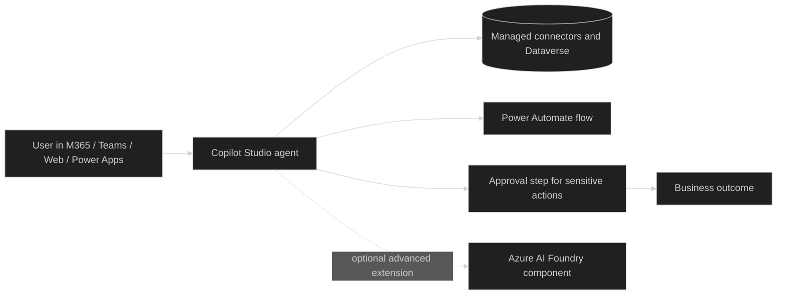

# Pattern 3 - Copilot Studio orchestrated agent (Acme)

## Use Case Guidance

Use this pattern for low-code orchestration where teams need broader connectors and business process actions.

Good fit:
- Department assistants with workflow steps and approvals.
- Cross-system retrieval and action using managed connectors.
- Scenarios needing faster delivery than pro-code engineering while still adding logic and actions.

Not a fit:
- Highly customized model engineering and advanced MLOps requirements.
- Fully autonomous high-risk actions without human approval.

## Business Classification

| Dimension | Classification |
|---|---|
| Business class | Departmental process optimization |
| Typical outcomes | Faster case handling, standardized flows, better handoffs |
| Owner | Low-code maker team with central platform governance |
| Change model | Low-code build with controlled release and environment governance |
| Control model | Managed orchestration with connector-based extensibility |

## Data Classification

| Data class | Pattern guidance |
|---|---|
| Internal | Primary fit |
| Confidential | Supported through approved connectors and environment DLP policies |
| Restricted | Supported only with explicit controls, role checks, and human approval for sensitive actions |
| Public | Fully supported |

## Mermaid Diagram

