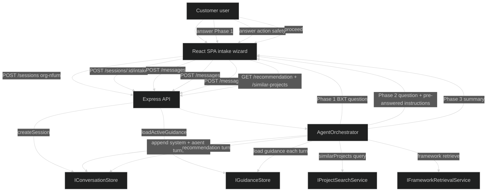
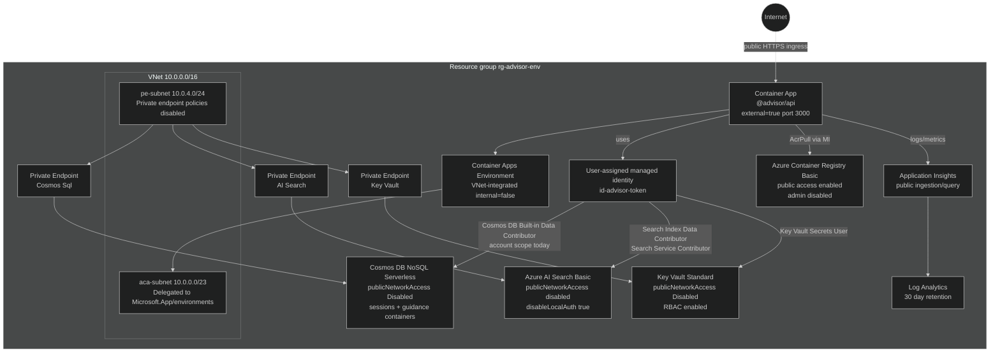

# Architecture Handoff — AI Framework Advisor Agent POC

_Last updated: 2026-05-29_  
_Owner: Trinity, Lead Architect_

The POC is a working advisor, not a production platform. Treat this handoff like a map with two layers: **POC reality** shows the roads that exist; **production target** shows the bridges the next team still needs to build.

## 1. API boundaries

### POC reality

Implemented in `agents\advisor\api\src\app.ts`.

| Method | Path | Purpose | Notes |
|---|---|---|---|
| `GET` | `/health` | Health probe for local/API/container readiness | Returns `{ ok: true, service, ts }`. Used by Container App probes. |
| `POST` | `/sessions` | Create an advisor session | Requires `customerOrganizationId`; optional `userId`; loads active guidance ID if present. |
| `POST` | `/sessions/:id/intake` | Submit structured intake and start Phase 1 | Stores intake on session convention field, appends system turn, returns first agent turn. |
| `POST` | `/sessions/:id/messages` | Continue advisor conversation | Appends user answer, advances readiness, returns next agent turn. |
| `POST` | `/sessions/:id/feedback` | Submit recommendation feedback | Requires numeric rating 1–5; optional comment; stores pending stakeholder review feedback. |
| `GET` | `/sessions/:id/messages/latest` | Read latest agent response | Returns latest agent turn and readiness state. No full session-read endpoint exists today. |
| `GET` | `/sessions/:id/recommendation` | Retrieve structured recommendation | Requires readiness `readyForRecommendation` or `recommendationDelivered`; otherwise `422`. |
| `GET` | `/sessions/:id/similar-projects` | Retrieve similar-project search result | Uses orchestrator search over in-memory or Azure AI Search adapter. |
| `DELETE` | `/sessions/:id` | End a session | Sets ended timestamp/readiness through store. |
| `GET` | `/admin/guidance/:orgId` | List guidance documents for org | No auth middleware yet. |
| `POST` | `/admin/guidance/:orgId` | Create/save guidance document | Forces `customerOrganizationId` from route. |
| `PUT` | `/admin/guidance/:orgId/:instructionSetId` | Update guidance document | Forces org and instruction set from route. |
| `POST` | `/admin/guidance/:orgId/:instructionSetId/activate` | Activate guidance version | Deactivates other versions in store implementation. |

Cross-cutting behavior:

- JSON body parsing and CORS are enabled globally.
- Correlation ID middleware uses `x-correlation-id` or generates a UUID.
- Errors use typed API error shapes where routes handle them; global handler returns `INTERNAL_ERROR`.

### Production target

| Area | Target |
|---|---|
| Auth | Entra External ID JWT middleware before all session/admin routes. |
| Org scoping | `customerOrganizationId` comes from token claims, not request body/path alone. |
| Admin paths | Align docs and routes: current code uses `/admin/guidance`; security docs describe `/orgs/{orgId}/guidance` as the production authorization shape. |
| Session reads | Add a scoped `GET /sessions/:id` if UI needs server-side recovery beyond latest message. |
| API management | Add APIM only when multiple orgs, rate limits, or formal API versioning are needed. |

## 2. Data flow

### POC reality



What is read/written:

| Step | Cosmos / conversation store | Guidance store | Search |
|---|---|---|---|
| Create session | Writes `AdvisorSession` with readiness `awaitingIntake` | Reads active guidance to set `activeInstructionSetId` | — |
| Submit intake | Updates session with `_intake`; appends system summary and first agent turn | Reads active guidance | — |
| Phase 1 answer | Appends user turn and captured fact; updates readiness | Reads active guidance | — |
| Phase 2 answer | Appends user turn/fact; updates readiness to recommendation-ready path | Reads active guidance | — |
| Recommendation | Appends recommendation turn; caches JSON in turn content | Reads active guidance | Reads similar projects; reads framework snippets |
| Feedback | Stores feedback via conversation store | — | — |
| Admin edit | — | Creates/updates/activates guidance | — |

Adapter switching in `composition.ts`:

| Environment | Conversation/guidance | Project/framework retrieval | Copilot service |
|---|---|---|---|
| No `COSMOS_ENDPOINT` or no `SEARCH_ENDPOINT` | In-memory | In-memory | Based on `ADVISOR_AGENT_MODE` |
| Both endpoints present | Cosmos DB adapters | Azure AI Search adapters | Based on `ADVISOR_AGENT_MODE` |
| `ADVISOR_AGENT_MODE=mock` | — | — | Deterministic mock, no LLM |
| `ADVISOR_AGENT_MODE=copilot` | — | — | Real adapter stub, requires token and SDK wiring |

### Production target

- Persist full project case lifecycle after recommendation, including Azure AI Search projection for future portfolio lookup.
- Remove cross-partition session lookup by adding org-aware store methods driven by auth context.
- Add ingestion jobs for project knowledge and framework content instead of manual seed loading only.
- Add tenant/org isolation checks at middleware, store, and query layers.

## 3. Three-phase advisor brain

### POC reality

Implemented in `AgentOrchestrator.ts` and `readinessGates.ts`:

| Phase | Current behavior |
|---|---|
| Phase 1: BXT | Intake creates a system summary; first advisor question checks feasibility around sensitive data and permissions. |
| Phase 2: Technology Groupings | Loads custom instructions, pre-answers matching Phase 2 questions, asks remaining action-safety question. |
| Phase 3: Scenario Selection | Summarizes interaction pattern, data strategy, action safety, orchestration; final message produces structured `RecommendationOutput`. |
| Recommendation | Deterministic output: Copilot Studio + Azure AI Search + Azure OpenAI / Microsoft Foundry, with rationale, trade-offs, assumptions, custom instruction influence, and similar-project highlights. |

### Production target

- Wire real Copilot SDK session behavior so the model reasons over all nine critical questions.
- Make Q8 `team_skills` influence the primary technology recommendation.
- Persist decision evidence as first-class data, not only reconstructed during recommendation building.
- Add streaming only if product UX requires it; POC uses request/response.

## 4. Infrastructure diagram

### POC reality

Auth, networking, and infra are implemented in Bicep under `agents\advisor\infra`.



### Production target

- Lock CORS to known front-end origins.
- Add ACR private endpoint/IP allowlist if production hosting supports it.
- Add NSG on `pe-subnet` allowing only required traffic from `aca-subnet`.
- Move Cosmos DB RBAC from account scope to container/database scope.
- Increase Key Vault soft-delete and Log Analytics retention to 90 days.
- Decide multi-region and DR posture; current Bicep is single-region.

## 5. Identity model

### POC reality

From `docs\security\identity-and-authorization.md` and Bicep:

| Principal | Current POC state | Access |
|---|---|---|
| Customer user | Not authenticated in code | Can call session endpoints if they can reach the API. |
| Customer org admin | Not authenticated in code | Can call admin guidance endpoints if they can reach the API. |
| Service identity | User-assigned managed identity | Used by Container App for Cosmos DB, AI Search, Key Vault, ACR pull, monitoring. |

Current security posture:

- Data-service auth uses managed identity and `DefaultAzureCredential` in real adapters.
- No Cosmos DB keys or AI Search keys are in source.
- Key Vault is provisioned private/RBAC, but no secrets are currently needed in mock mode.
- `ADVISOR_AGENT_MODE=copilot` would require `GITHUB_TOKEN` or `COPILOT_TOKEN`; that secret path must go through Key Vault, not source or azd env files.

### Production target

| Principal | Target |
|---|---|
| Customer user | Entra External ID user with `organizationId` claim; can create/continue own sessions and read recommendations. |
| Customer org admin | Entra External ID user with `organizationId` plus `OrgAdmin` role; can manage only matching org guidance. |
| Service identity | User-assigned managed identity remains the only data-plane caller. |

Required authorization invariant:

```text
For admin guidance access:
require roles contains OrgAdmin
require token.organizationId == route orgId
write customerOrganizationId from trusted auth context, not user input
```

## 6. Open decisions and gaps

### POC reality — not hidden

| Decision/gap | Current state | Source |
|---|---|---|
| Real Copilot SDK runtime | `RealCopilotSessionService` is a guarded stub selected by `ADVISOR_AGENT_MODE=copilot`; mock is used for green POC. | `api\src\adapters\inmemory\RealCopilotSessionService.ts` |
| Auth | Entra External ID selected, not implemented. | AD-06 + security docs |
| Session isolation | Org partitioning exists in Cosmos containers; auth-backed org scoping not wired. | Cosmos Bicep + security docs |
| CORS | API/ACA allow wildcard origins. | `containerapp.bicep` |
| ACR | Public access enabled, admin disabled. | `acr.bicep` |
| Search ranking | Azure adapter supports BM25 and optional semantic re-ranking; vector strategy remains open. | `data\docs\search-index.md`, AD-03 |
| No full session read endpoint | Latest-message and recommendation endpoints exist; full session read does not. | `app.ts` |
| Developer cloud-data debugging | Portal explorers now; P2S VPN deferred until needed. | security decisions inbox |

### Production target — next team owns

See `next-phase-backlog.md` for the buildable backlog. The POC exit criteria are done; these are net-new hardening items.
